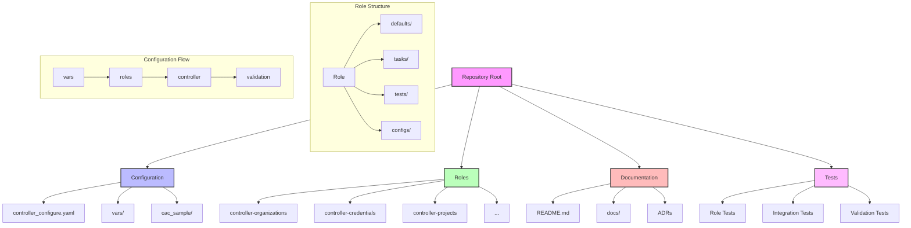

# ADR-000: Repository Structure and Organization

## Status
Proposed

## Context
The repository implements Configuration as Code (CaC) for Ansible Automation Platform. A clear understanding of the repository structure is essential for maintainers and contributors. This ADR documents the complete repository structure and organization.

## Decision
We will maintain a structured repository with clear separation of concerns between configuration, roles, and documentation. The repository structure is organized as follows:

### Root Level
```
.
├── README.md                    # Project documentation
├── ansible-navigator.yml        # Navigator configuration
├── ansible.cfg                  # Ansible configuration
├── controller_configure.yaml    # Main configuration playbook
├── controller_configure-v2.yaml # Version 2 of configuration playbook
├── controller_export.yaml      # Export configuration playbook
├── configure-mcp-server.sh     # Server configuration script
├── hosts                       # Inventory file
├── requirements.yml            # Dependencies
└── docs/                       # Documentation directory
    └── IMPLEMENTATION.md       # Implementation guide
```

### Configuration Files (cac_sample/)
```
cac_sample/
├── controller_auth.yml
├── credential_types.yaml
├── credentials.yaml
├── groups.yml
├── hosts.yml
├── instance_groups.yml
├── inventories.yaml
├── inventory_sources.yml
├── notifications.yml
├── organizations.yaml
├── projects.yaml
├── roles.yml
├── schedule.yml
├── settings.yaml
├── teams.yml
├── templates.yaml
├── user_accounts.yml
└── workflows.yaml
```

### Roles Structure
The `roles/` directory contains modular roles for different aspects of controller configuration:
```
roles/
├── controller-configuration/
├── controller-credential-types/
├── controller-credentials/
├── controller-export/
├── controller-groups/
├── controller-hosts/
├── controller-instance_groups/
├── controller-inventories/
├── controller-inventory_sources/
├── controller-job-templates/
├── controller-organizations/
├── controller-projects/
├── controller-roles/
├── controller-schedules/
├── controller-settings/
├── controller-teams/
├── controller-users/
├── controller-workflow-job-templates/
├── global_vars/
├── notification-notification-templates/
└── project_update/
```

Each role follows a standard structure:
```
role-name/
├── README.md
├── defaults/
│   └── main.yml
├── meta/
├── tasks/
│   └── main.yml
├── tests/
│   └── test.yml
└── configs/
```

### Variables (vars/)
```
vars/
├── controller_configuration_control.yaml
├── controller_export_control.yaml
└── general.yaml
```

### Tests
```
tests/
└── validate_config.yaml
```

## Component Relationships



## Consequences

### Positive
1. **Clear Organization**
   - Each component has a dedicated location
   - Standardized role structure
   - Separation between configuration and implementation
   - Easy to locate specific functionality

2. **Maintainability**
   - Modular role-based approach
   - Centralized variable management
   - Standardized testing structure
   - Clear documentation placement

3. **Scalability**
   - Easy to add new roles
   - Consistent structure for new components
   - Sample configurations provided
   - Clear testing framework

### Negative
1. **Complexity**
   - Deep directory structure requires familiarity
   - Multiple configuration files to manage
   - Need to maintain documentation across many components

2. **Learning Curve**
   - New contributors need to understand role structure
   - Multiple layers of configuration
   - Complex relationship between components

## Implementation Notes

1. **Role Structure**
   - Each role follows Ansible best practices
   - Includes default variables
   - Contains dedicated tests
   - Includes role-specific documentation

2. **Configuration Management**
   - Sample configurations provided in `cac_sample/`
   - Variable hierarchy in `vars/`
   - Separate control files for configuration and export

3. **Testing Strategy**
   - Dedicated test directory
   - Role-specific tests
   - Configuration validation

## Related Decisions
- ADR-001: Configuration as Code Implementation
- ADR-002: Security and Credential Management (proposed)
- ADR-003: Configuration Validation Strategy (proposed)
- ADR-004: Role-Based Architecture (proposed) 