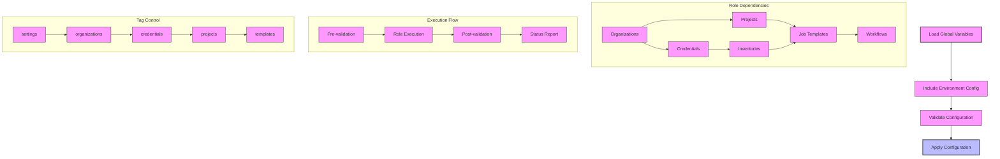
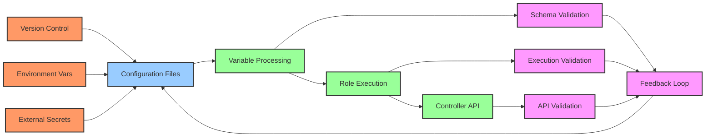

# ADR-001: Configuration as Code Implementation

## Status
Proposed

## Context
Ansible Automation Platform (AAP) configurations need to be managed across multiple environments in a consistent, version-controlled manner. The traditional approach of manual configuration through the web interface is error-prone and doesn't scale well.

## Decision
We will implement a Configuration as Code (CaC) solution with the following key architectural decisions:

### 1. Modular Role-Based Implementation
```yaml
- controller-settings
- controller-organizations
- controller-credentials
- controller-projects
- controller-inventories
- controller-job-templates
- controller-workflow-job-templates
# ... and other specialized roles
```

Each component of the AAP configuration is managed by a dedicated role, following the single responsibility principle.

### 2. Tag-Based Execution Control
```yaml
- name: Add organizations
  ansible.builtin.include_role:
    name: controller-organizations
    apply:
      tags: organizations
  when: controller_organizations is defined
  tags:
    - organizations
```

Configuration tasks are organized with tags to allow:
- Selective execution of specific components
- Phased rollout of configurations
- Independent management of different configuration aspects

### 3. Variable-Driven Configuration
Configuration data is separated from implementation:
```
vars/
├── general.yaml                        # Global settings
├── controller_configuration_control.yaml  # Control variables
└── environments/                       # Environment-specific configs
```

### 4. Conditional Execution
Each configuration component is conditionally executed:
```yaml
when: controller_<component> is defined
```
This allows for:
- Partial configurations
- Environment-specific component deployment
- Gradual rollout of changes

### 5. Configuration Validation
Pre-execution validation ensures:
- Required variables are present
- Configuration values are valid
- Dependencies are satisfied

### 6. Sample Configurations
Provides reference implementations in `cac_sample/`:
```
cac_sample/
├── credential_types.yaml
├── credentials.yaml
├── organizations.yaml
└── ... other configuration samples
```

## Consequences

### Positive
1. **Version Control**
   - All configurations are tracked in Git
   - Change history is maintained
   - Roll-back capability

2. **Consistency**
   - Standardized configuration format
   - Reusable across environments
   - Reduced configuration drift

3. **Automation**
   - Automated deployment of configurations
   - Reduced manual intervention
   - Faster environment setup

4. **Validation**
   - Pre-execution validation
   - Reduced configuration errors
   - Dependency checking

### Negative
1. **Learning Curve**
   - Team needs to learn CaC approach
   - Understanding of Ansible required
   - Knowledge of AAP internals needed

2. **Initial Setup**
   - More upfront work to create configurations
   - Need to maintain configuration files
   - Testing requirements increase

## Implementation Notes

### 1. Configuration Flow
1. Load global variables
2. Include environment-specific configurations
3. Validate configurations
4. Apply configurations in dependency order

### 2. Role Dependencies and Configuration Flow



### 3. Configuration Components and Data Flow



## Related Decisions
- ADR-000: Repository Structure and Organization
- ADR-002: Security and Credential Management
- ADR-003: Configuration Validation Strategy
- ADR-004: Role-Based Architecture 