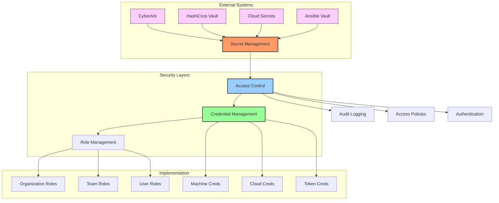
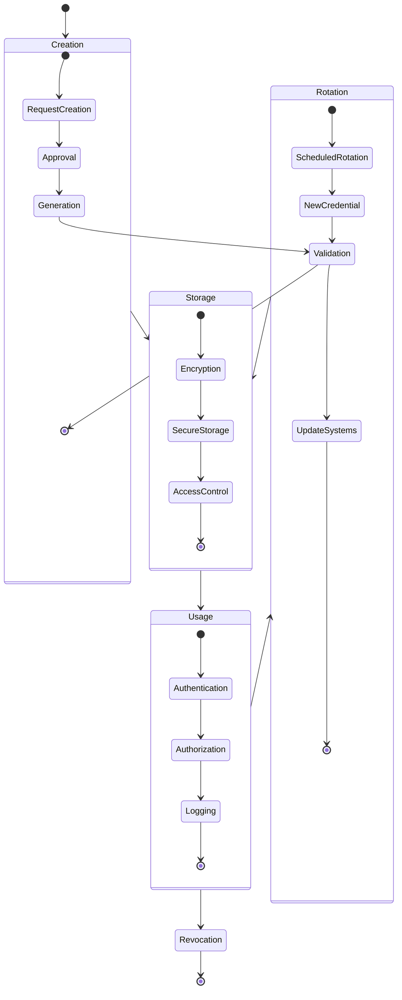

# ADR-002: Security and Credential Management

## Status
Proposed

## Context
Managing credentials and security configurations in a Configuration as Code (CaC) environment requires careful consideration of security practices, especially when dealing with sensitive data like passwords, tokens, and SSH keys.

## Decision
We will implement a comprehensive security and credential management system with the following key decisions:

### 1. Credential Type Separation
Different credential types are managed separately:
```yaml
- Machine credentials (SSH/Password)
- OpenShift/Kubernetes tokens
- Source Control credentials
- Vault credentials
- Cloud provider credentials
```

### 2. Secure Logging Control
```yaml
controller_configuration_credentials_secure_logging: false
```
Configurable secure logging to prevent sensitive data exposure in logs.

### 3. Credential Structure
Standard credential definition format:
```yaml
- credential_type: <type>
  organization: <org>
  name: <name>
  description: <description>
  inputs:
    <type-specific-fields>
```

### 4. Secret Management
1. **Update Control**
   ```yaml
   update_secrets: false  # Prevent accidental secret updates
   ```

2. **Variable References**
   ```yaml
   ssh_key_data: "{{ ssh_private_key }}"  # Reference to external variable
   ```

3. **Environment Separation**
   - Development credentials
   - Staging credentials
   - Production credentials

### 5. Integration Support
Support for external secret management systems:
- Ansible Vault
- CyberArk
- HashiCorp Vault
- Cloud-native secret managers

### 6. Security Architecture



### 7. Credential Flow and Lifecycle



## Consequences

### Positive
1. **Enhanced Security**
   - Separation of sensitive data
   - Controlled access to credentials
   - Integration with enterprise security systems

2. **Maintainability**
   - Standardized credential format
   - Clear organization structure
   - Version-controlled configurations

3. **Flexibility**
   - Support for multiple credential types
   - External secret management integration
   - Environment-specific credentials

### Negative
1. **Complexity**
   - Additional security layers
   - Multiple credential sources
   - Integration complexity

2. **Management Overhead**
   - Credential rotation
   - Access control maintenance
   - Multiple environment management

## Implementation Notes

### 1. Credential Hierarchy
```
Organization
└── Credential Types
    └── Credentials
        └── Inputs
```

### 2. Security Best Practices
1. **Never store plain text secrets in version control**
2. **Use external secret management systems**
3. **Implement role-based access control**
4. **Regular credential rotation**
5. **Audit logging of credential usage**

### 3. Credential Types
1. **Machine Access**
   - SSH keys
   - Username/password
   - Sudo privileges

2. **Cloud Platforms**
   - API tokens
   - Access keys
   - Service accounts

3. **Source Control**
   - Personal access tokens
   - SSH keys
   - OAuth tokens

### 4. Environment Considerations
1. **Development**
   - Relaxed security for rapid development
   - Local secret management
   - Development-specific credentials

2. **Production**
   - Strict security controls
   - Enterprise secret management
   - Limited access credentials

## Related Decisions
- ADR-000: Repository Structure and Organization
- ADR-001: Configuration as Code Implementation
- ADR-003: Configuration Validation Strategy
- ADR-004: Role-Based Architecture 