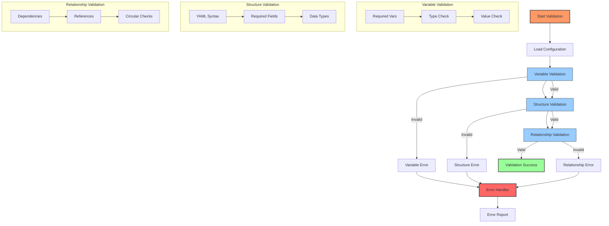
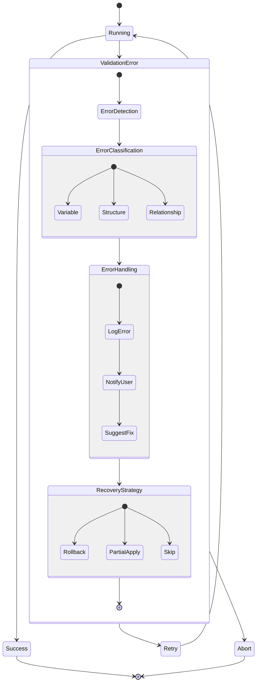

# ADR-003: Configuration Validation Strategy

## Status
Proposed

## Context
Configuration as Code requires robust validation to ensure configurations are correct before deployment. This is especially important in an Ansible Automation Platform context where invalid configurations can impact automation across the organization.

## Decision
We will implement a comprehensive validation strategy with the following components:

### 1. Pre-Execution Validation
```yaml
- name: Validate required variables
  ansible.builtin.assert:
    that:
      - controller_configs_dir is defined
      - controller_configs_dir | length > 0
    fail_msg: "Required variable controller_configs_dir is not defined or empty"
    success_msg: "Basic variable validation passed"
```

### 2. Configuration Structure Validation
```yaml
- name: Validate organization configuration
  when: controller_organizations is defined
  ansible.builtin.assert:
    that:
      - controller_organizations is iterable
      - controller_organizations | length > 0
    fail_msg: "Invalid organization configuration"
```

### 3. Validation Layers
1. **Basic Variable Validation**
   - Required variables present
   - Variable types correct
   - Non-empty required values

2. **Configuration Structure**
   - Valid YAML syntax
   - Required fields present
   - Correct data types

3. **Relationship Validation**
   - Dependencies exist
   - Circular references checked
   - Valid references between components

### 4. Error Handling
```yaml
rescue:
  - name: Configuration validation failed
    ansible.builtin.fail:
      msg: "Configuration validation failed. Please check your configuration files."
```

### 5. Validation Scope
- Global variables
- Organization configurations
- Credential configurations
- Project configurations
- Inventory configurations
- Template configurations
- Workflow configurations

### 6. Validation Process Flow



### 7. Error Handling and Recovery Process



## Consequences

### Positive
1. **Error Prevention**
   - Catches configuration errors early
   - Prevents invalid deployments
   - Reduces troubleshooting time

2. **Standardization**
   - Enforces configuration standards
   - Ensures consistent structure
   - Maintains data quality

3. **Reliability**
   - Validates dependencies
   - Ensures complete configurations
   - Prevents partial updates

### Negative
1. **Overhead**
   - Additional processing time
   - More complex configurations
   - Maintenance of validation rules

2. **Flexibility**
   - Strict validation rules
   - Less flexibility in structure
   - Additional documentation needed

## Implementation Notes

### 1. Validation Process
1. **Load Configuration**
   ```yaml
   - name: Include vars from configs directory
     ansible.builtin.include_vars:
       dir: "{{ controller_configs_dir }}"
       extensions: ['yaml', 'yml']
   ```

2. **Basic Validation**
   - Check required variables
   - Validate data types
   - Verify non-empty values

3. **Structure Validation**
   - Validate configuration format
   - Check required fields
   - Verify relationships

4. **Custom Validation**
   - Organization-specific rules
   - Environment-specific checks
   - Custom constraints

### 2. Validation Rules
1. **Required Fields**
   - Name
   - Type
   - Organization
   - Description

2. **Data Types**
   - Strings
   - Lists
   - Dictionaries
   - Boolean values

3. **Relationships**
   - Organization exists
   - Credentials valid
   - Projects accessible

### 3. Error Handling
1. **Clear Messages**
   - Specific error descriptions
   - Location of error
   - Suggested fixes

2. **Graceful Failure**
   - Safe error handling
   - No partial updates
   - Clean rollback

### 4. Testing Strategy
1. **Unit Tests**
   - Individual validation rules
   - Error handling
   - Edge cases

2. **Integration Tests**
   - Complete configurations
   - Cross-component validation
   - Environment validation

## Related Decisions
- ADR-000: Repository Structure and Organization
- ADR-001: Configuration as Code Implementation
- ADR-002: Security and Credential Management
- ADR-004: Role-Based Architecture 