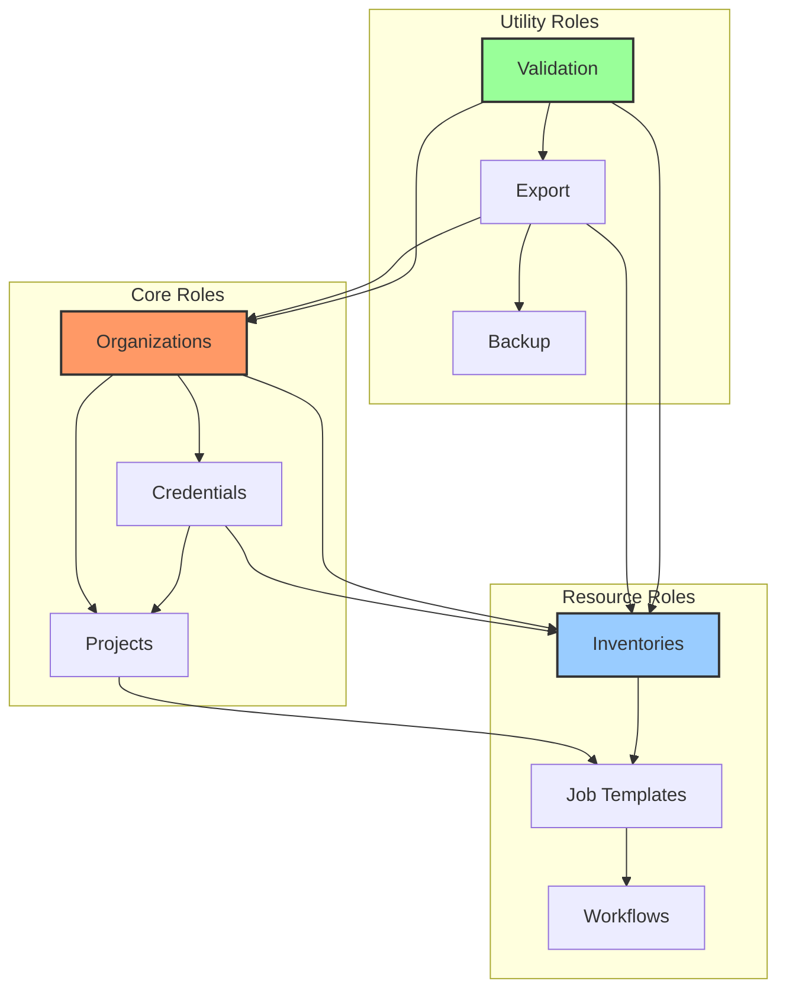
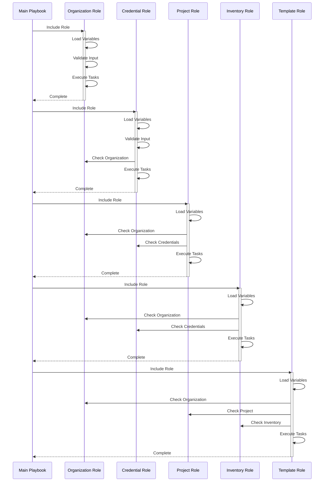
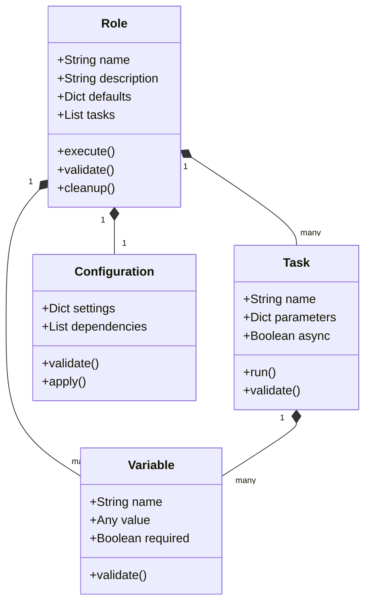

# ADR-004: Role-Based Architecture

## Status
Proposed

## Context
The Ansible Automation Platform configuration requires a modular, maintainable, and scalable approach to managing different aspects of the system. A role-based architecture provides the necessary structure and separation of concerns.

## Decision
We will implement a role-based architecture where each major configuration component is managed by a dedicated role. The architecture follows these key principles:

### 1. Role Organization
```
roles/
├── controller-organizations/      # Organization management
├── controller-credentials/        # Credential management
├── controller-projects/          # Project management
├── controller-inventories/       # Inventory management
├── controller-job-templates/     # Job template management
└── ... other specialized roles
```

### 2. Standard Role Structure
Each role follows a consistent structure:
```
role-name/
├── README.md                 # Role documentation
├── defaults/                 # Default variables
│   └── main.yml
├── meta/                    # Role metadata
├── tasks/                   # Role tasks
│   └── main.yml
├── tests/                   # Role tests
│   └── test.yml
└── configs/                 # Sample configurations
```

### 3. Role Implementation Pattern
Example from organization role:
```yaml
- name: Add organizations
  ansible.controller.organization:
    name: "{{ __controller_organizations_item.name | mandatory }}"
    description: "{{ __controller_organizations_item.description | default('') }}"
    state: "{{ __controller_organizations_item.state | default('present') }}"
    # ... other parameters
  loop: "{{ controller_organizations }}"
```

### 4. Role Features
1. **Async Operation Support**
   ```yaml
   async: 1000
   poll: 0
   register: __organizations_job_async
   ```

2. **Secure Logging**
   ```yaml
   no_log: "{{ controller_configuration_organizations_secure_logging }}"
   ```

3. **Default Handling**
   ```yaml
   default: "{{ variable | default(omit, true) }}"
   ```

### 5. Role Dependencies
Roles are designed to be:
- Independent where possible
- Clearly documented dependencies
- Ordered execution when required

## Consequences

### Positive
1. **Modularity**
   - Independent components
   - Easy to maintain
   - Clear responsibilities

2. **Reusability**
   - Roles can be shared
   - Consistent implementation
   - Reduced code duplication

3. **Scalability**
   - Easy to add new roles
   - Clear extension points
   - Manageable complexity

4. **Maintainability**
   - Standard structure
   - Clear documentation
   - Isolated changes

### Negative
1. **Complexity**
   - More files to manage
   - Role interaction complexity
   - Learning curve

2. **Overhead**
   - Role setup time
   - Documentation maintenance
   - Testing requirements

## Implementation Notes

### 1. Role Development Guidelines
1. **Documentation**
   - Clear README
   - Variable documentation
   - Usage examples

2. **Testing**
   - Unit tests
   - Integration tests
   - Sample configurations

3. **Variables**
   - Clear naming
   - Default values
   - Documentation

### 2. Role Interaction Patterns
1. **Variable Sharing**
   ```yaml
   vars:
     shared_var: "{{ role_specific_var }}"
   ```

2. **Role Dependencies**
   ```yaml
   dependencies:
     - role: prerequisite-role
       vars:
         key: value
   ```

3. **Conditional Execution**
   ```yaml
   when: condition_variable is defined
   ```

### 3. Role Best Practices
1. **Idempotency**
   - State-based operations
   - Check before action
   - Clear success criteria

2. **Error Handling**
   - Clear error messages
   - Failure recovery
   - Status reporting

3. **Performance**
   - Async operations
   - Efficient loops
   - Resource management

### 4. Role Categories
1. **Core Roles**
   - Organizations
   - Credentials
   - Projects

2. **Resource Roles**
   - Inventories
   - Job Templates
   - Workflows

3. **Utility Roles**
   - Validation
   - Export
   - Backup

### 5. Role Architecture and Interactions



### 6. Role Execution Flow



### 7. Role Component Structure



## Related Decisions
- ADR-000: Repository Structure and Organization
- ADR-001: Configuration as Code Implementation
- ADR-002: Security and Credential Management
- ADR-003: Configuration Validation Strategy