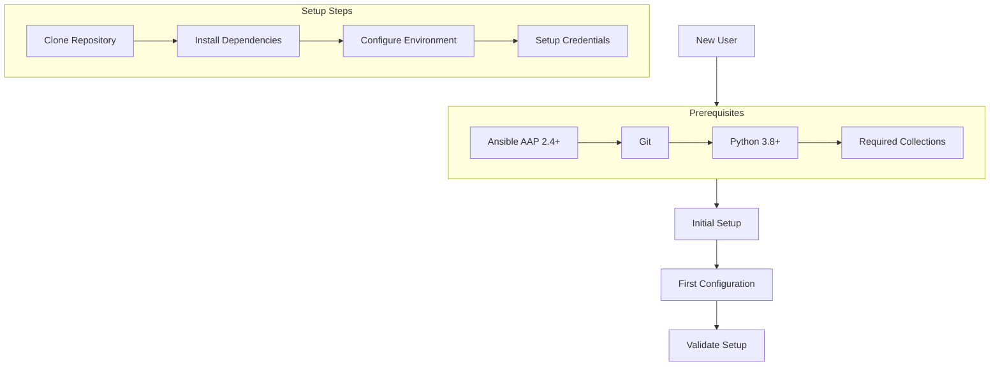
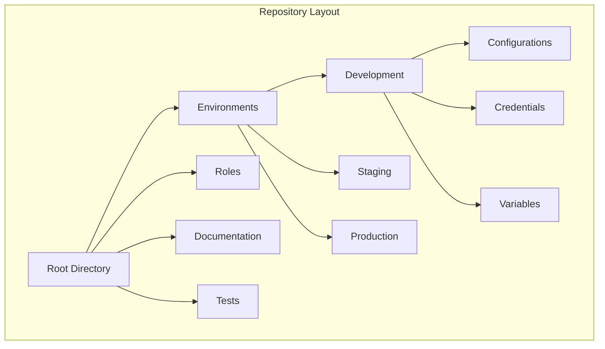
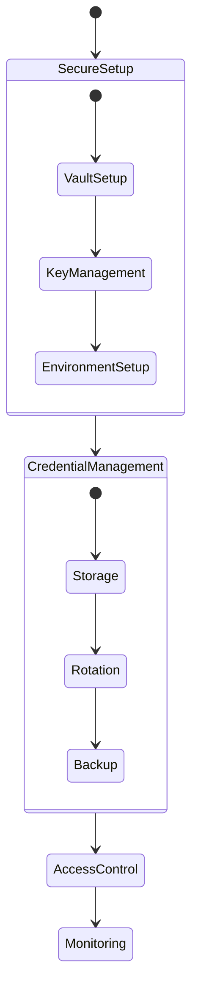

# ADR-005: New User Guide and Common Questions

## Status

Accepted

## Context

As our Configuration as Code (CaC) implementation grows, new users need clear guidance on getting started, understanding the architecture, and following best practices. This ADR addresses common questions and provides structured guidance for new users.

## Decision

We will provide a comprehensive guide structured around key areas of concern for new users, including setup, configuration, security, and maintenance.

### 1. Getting Started Flow



### 2. Configuration Structure



### 3. Security Implementation



## Implementation Notes

### 1. Prerequisites and Setup
- Ansible Automation Platform 2.4 or later
- Git for version control
- Python 3.8 or later
- Required Ansible collections:
  ```yaml
  collections:
    - ansible.controller
    - infra.controller_configuration
  ```

### 2. Initial Configuration Steps
1. Clone the repository
   ```bash
   git clone <repository-url>
   cd ansible-controller-cac
   ```

2. Set up environment variables
   ```bash
   export CONTROLLER_HOST=<your-controller-host>
   export CONTROLLER_USERNAME=<your-username>
   export CONTROLLER_PASSWORD=<your-password>
   ```

3. Validate setup
   ```bash
   ansible-playbook validate_setup.yml
   ```

### 3. Common Use Cases

#### Basic Configuration
```yaml
# Example organization configuration
organizations:
  - name: "Example Org"
    description: "Example Organization"
    max_hosts: 100
    custom_virtualenv: "/var/lib/awx/venv/ansible"
```

#### Credential Management
```yaml
# Example credential configuration
credentials:
  - name: "Example Credential"
    description: "Example Machine Credential"
    credential_type: "Machine"
    organization: "Example Org"
    inputs:
      username: "{{ vault_username }}"
      password: "{{ vault_password }}"
```

### 4. Troubleshooting Guide

| Issue | Check | Solution |
|-------|-------|----------|
| Connection Failed | Environment Variables | Verify CONTROLLER_* variables |
| Authentication Error | Credentials | Check credential permissions |
| Validation Error | Configuration | Validate YAML syntax |
| Role Error | Dependencies | Check role requirements |

## Consequences

### Positive
- Clear onboarding path for new users
- Standardized setup process
- Reduced support burden
- Consistent implementation across teams

### Negative
- Additional documentation to maintain
- May need regular updates as platform evolves
- Some complexity in covering all use cases

## Related Decisions
- ADR-000: Repository Structure
- ADR-001: Configuration Implementation
- ADR-002: Security and Credential Management
- ADR-003: Configuration Validation Strategy
- ADR-004: Role-Based Architecture

## Notes
1. Regular review and updates required
2. Consider user feedback for improvements
3. Maintain alignment with platform updates
4. Keep security guidance current

## References
1. [Ansible Automation Platform Documentation](https://docs.ansible.com/automation-controller/latest/html/userguide/index.html)
2. [Controller Configuration Collection](https://github.com/redhat-cop/controller_configuration)
3. [Ansible Best Practices](https://docs.ansible.com/ansible/latest/user_guide/playbooks_best_practices.html) 