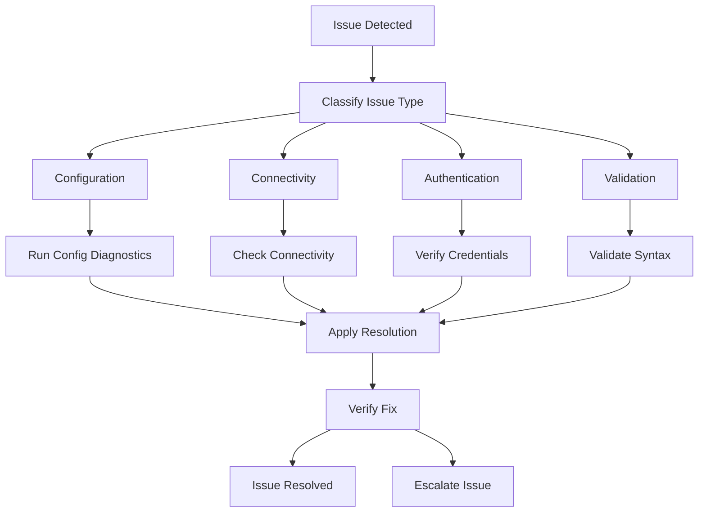
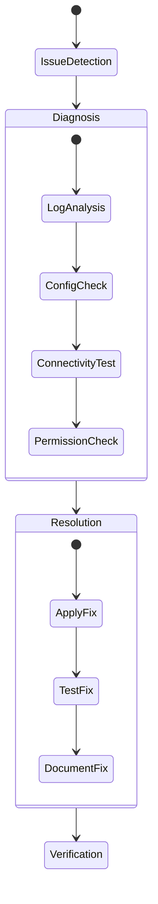
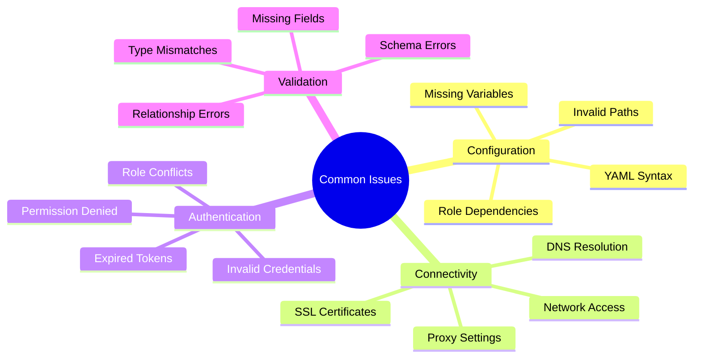

# ADR-006: Troubleshooting Guide and Problem Resolution

## Status

Accepted

## Context

Users frequently encounter common issues during setup, configuration, and operation of the Ansible Controller Configuration as Code. A structured approach to troubleshooting and problem resolution is needed to help users quickly identify and resolve issues.

## Decision

We will provide a comprehensive troubleshooting guide that covers common scenarios, diagnostic procedures, and resolution steps.

### 1. Troubleshooting Flow



### 2. Diagnostic Process



### 3. Common Issues and Solutions



## Implementation Notes

### 1. Diagnostic Commands

#### Configuration Validation
```bash
# Validate YAML syntax
ansible-playbook --syntax-check playbook.yml

# Check variable definitions
ansible-playbook -i inventory check_vars.yml --check

# Verify role dependencies
ansible-galaxy install -r requirements.yml --list
```

#### Connectivity Testing
```bash
# Test controller connectivity
curl -k https://${CONTROLLER_HOST}/api/v2/ping/

# Check network connectivity
ansible -m ping all

# Verify SSL certificates
openssl s_client -connect ${CONTROLLER_HOST}:443
```

### 2. Common Error Messages and Solutions

| Error Message | Possible Cause | Solution |
|--------------|----------------|----------|
| "Unable to connect to host" | Network/Firewall | Check firewall rules and DNS |
| "Authentication failed" | Invalid credentials | Verify environment variables |
| "Role not found" | Missing dependency | Run ansible-galaxy install |
| "Invalid YAML syntax" | Configuration error | Use YAML linter to validate |

### 3. Logging and Debugging

#### Enable Debug Logging
```yaml
# ansible.cfg
[defaults]
log_path = ./ansible.log
verbosity = 2

# Environment variable
export ANSIBLE_DEBUG=1
```

#### Log Analysis
```bash
# Search for errors
grep -i error ansible.log

# Check task execution
grep -i "TASK" ansible.log

# Monitor real-time logs
tail -f ansible.log
```

## Consequences

### Positive
- Faster issue resolution
- Reduced support tickets
- Improved user experience
- Standardized troubleshooting process

### Negative
- Need to maintain troubleshooting documentation
- May require updates for new error scenarios
- Additional logging overhead

## Related Decisions
- ADR-003: Configuration Validation Strategy
- ADR-005: New User Guide and Common Questions

## Notes
1. Keep error message database updated
2. Document new issues and solutions
3. Regular review of common problems
4. Update diagnostic procedures as needed

## References
1. [Ansible Troubleshooting Guide](https://docs.ansible.com/ansible/latest/user_guide/troubleshooting.html)
2. [Controller API Documentation](https://docs.ansible.com/automation-controller/latest/html/controllerapi/index.html)
3. [YAML Syntax Guide](https://docs.ansible.com/ansible/latest/reference_appendices/YAMLSyntax.html) 