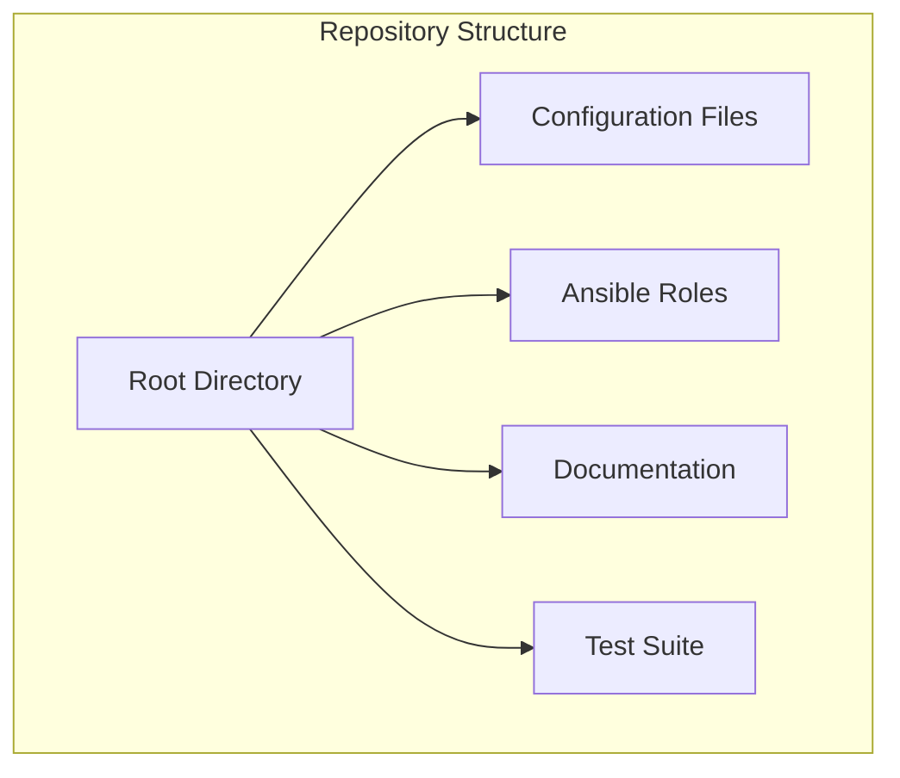

# Implementing Configuration as Code for Ansible Automation Platform: A Comprehensive Approach

## Introduction

In today's rapidly evolving IT landscape, managing infrastructure configuration at scale requires a systematic and automated approach. This blog post explores our implementation of Configuration as Code (CaC) for Ansible Automation Platform, detailing how we've structured our solution to provide a robust, maintainable, and secure automation framework.

## Why Configuration as Code?

Configuration as Code (CaC) represents a paradigm shift in how we manage infrastructure configurations. Instead of manual configurations or database replications, we treat our configurations as versioned code, enabling:

- Version control and change tracking
- Automated testing and validation
- Consistent deployments across environments
- Reduced human error
- Improved collaboration and knowledge sharing

## Our Architecture

Our implementation is built on several key architectural decisions, documented in our ADRs:

### 1. Repository Structure ([ADR-000](docs/ADR-000-repository-structure.md))

We've organized our repository to provide clear separation of concerns while maintaining flexibility and scalability. Key components include:
- Configuration templates
- Role-based implementations
- Comprehensive documentation
- Automated test suites

### 2. Configuration Implementation ([ADR-001](docs/ADR-001-configuration-as-code-implementation.md))

Our CaC implementation follows these core principles:
- Modular role-based implementation
- Tag-based execution control
- Variable-driven configuration
- Conditional execution
- Configuration validation

### 3. Security and Credential Management ([ADR-002](docs/ADR-002-security-and-credential-management.md))

Security is paramount in our implementation:
- Credential type separation
- Secure logging control
- Standardized credential structure
- Integration with external secret management systems
- Role-based access control

### 4. Validation Strategy ([ADR-003](docs/ADR-003-configuration-validation-strategy.md))

Our validation approach ensures configuration integrity through:
- Pre-execution validation
- Configuration structure validation
- Relationship validation
- Clear error handling
- Comprehensive testing strategy

### 5. Role-Based Architecture ([ADR-004](docs/ADR-004-role-based-architecture.md))

The role-based architecture provides:
- Clear separation of responsibilities
- Reusable components
- Standardized implementation patterns
- Simplified maintenance
- Scalable design

## Implementation Best Practices

Based on industry standards and our experience, we follow these best practices:

1. **Version Control**
   - Use Git for configuration versioning
   - Implement branching strategies for different environments
   - Tag releases for easy rollback

2. **Testing**
   - Automated validation of configurations
   - Integration testing across roles
   - Environment-specific testing

3. **Security**
   - Encrypted sensitive data using Ansible Vault
   - Role-based access control
   - Audit logging

4. **Documentation**
   - Comprehensive ADRs
   - Inline code documentation
   - Usage examples and guides

## Real-World Benefits

Our implementation has delivered several key benefits:

1. **Reduced Deployment Time**
   - Automated configuration deployment
   - Consistent environment setup
   - Reduced manual intervention

2. **Improved Reliability**
   - Validated configurations
   - Version-controlled changes
   - Automated testing

3. **Enhanced Security**
   - Secure credential management
   - Audit trails
   - Access control

4. **Better Collaboration**
   - Clear documentation
   - Version control
   - Standardized practices

## External References and Tools

Our implementation leverages several key tools and practices:

1. **Ansible Collections**
   - [ansible.controller](https://console.redhat.com/ansible/automation-hub/repo/published/ansible/controller/)
   - [infra.controller_configuration](https://github.com/redhat-cop/controller_configuration)

2. **GitOps Practices**
   - [Red Hat GitOps](https://www.redhat.com/en/topics/devops/what-is-gitops)
   - [Ansible GitOps Best Practices](https://www.ansible.com/blog/ansible-automation-platform-2.3-configuration-as-code-improvements)

3. **Security Standards**
   - [Ansible Security Automation](https://www.redhat.com/en/topics/security/security-automation)
   - [CIS Benchmarks](https://www.cisecurity.org/benchmark/red_hat_linux)

## Conclusion

Our Configuration as Code implementation for Ansible Automation Platform demonstrates how modern infrastructure management can be both powerful and maintainable. By following clear architectural decisions, implementing robust security measures, and adhering to industry best practices, we've created a solution that scales with our needs while maintaining security and reliability.

For detailed implementation guidance, please refer to our [ADRs](docs/) and the project's [README.md](README.md).

## Contributing

We welcome contributions! Please see our contributing guidelines and feel free to submit pull requests or open issues for discussion.

---
*Last updated: [Current Date]* 